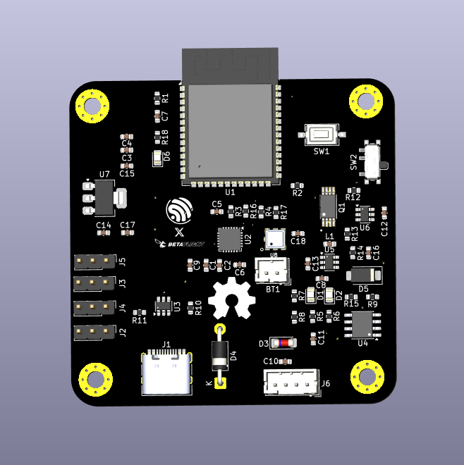

# ESP32-S3 Flight Controller Board



A custom-designed flight controller based on the ESP32-S3 module, built for compatibility with the **esp-fc** firmware and **Betaflight-like** configuration.  
This board integrates essential flight-control sensors, power-management circuitry, and expansion interfaces, making it suitable for quadcopters, robotics, and experimental UAV platforms.

---

## 📌 Key Features

### **Core MCU**
- ESP32-S3 bare module
- Dual-core Xtensa LX7 processor
- Native USB for firmware flashing

### **Integrated Sensors**
- **MPU6050** – 6-axis gyro + accelerometer  
- **BMP180** – Barometric pressure & altitude sensor

### **Power System**
- **TP4056** Li-ion charging module with protection  
- **Boost converter (4.2 V → 5 V)** for stable ESP32-S3 power  
- On-board 3.3 V regulator

### **Motor & IO Support**
- **4-Motor outputs** (quad-rotor configuration)  
- Dedicated timer pins compatible with `esp-fc` firmware  
- JST-I2C connector for user-defined expansion modules

### **Firmware Compatibility**
- Fully compatible with  
  - https://github.com/rtlopez/esp-fc  
  - Betaflight-style configuration  
- Designed around the esp-fc recommended pin mappings

---

## 📂 Repository Structure

```

ESP32-FC-Board/
│
├── README.md              # Project documentation
├── LICENSE                # Apache license recommended
├── Hardware/
|___Gerber/                # Gerber files for PCB manufacturing
├── 3DModels/              # STEP/WRL models (optional)
└── Images/                # Photos, renders, pinout diagrams

```

---

## 🛠️ Hardware Overview

### **Sensors**
- MPU6050 connected via I2C  
- BMP180 connected via I2C  
- Pull-ups included where required  

### **Power Path**
- USB or battery input  
- Charging through TP4056  
- Protected 4.2 V → boosted 5 V  
- Local 3.3 V regulator for ESP32-S3 & sensors

### **Connectors**
- Motor outputs (4x)
- I2C JST connector for add-on modules
- Debug pads (TX/RX/5V/GND)

---

## 🚀 Firmware Setup

1. Clone the `esp-fc` firmware:  
```

[https://github.com/rtlopez/esp-fc](https://github.com/rtlopez/esp-fc)

```

2. Select **ESP32-S3 target** in configuration.

3. Flash firmware using:  
- Betaflight Configurator

4. Configure sensor orientation and motor mapping as per schematics.

---

## 📄 Manufacturing

The `Hardware/Gerber/` folder includes:
- Top/Bottom Copper  
- Solder mask  
- Silkscreen  
- Drill files  
- Board outline  

These files can be uploaded to any PCB manufacturer such as JLCPCB, PCBWay, or OSH Park.

---

## 📸 Images & Diagrams

Board renders, real PCB photos, and pin-mapping diagrams are available in:

[Images](Images)

---

## 📜 License

This project is open-source.  
Choose your preferred license (MIT recommended for hardware projects).

---

## 🙌 Contributions

Contributions, improvements, and documentation updates are welcome.  
Feel free to open issues or pull requests.

---

## 📧 Contact

For questions, improvements, or collaboration ideas, open an Issue or contact the project maintainer.
